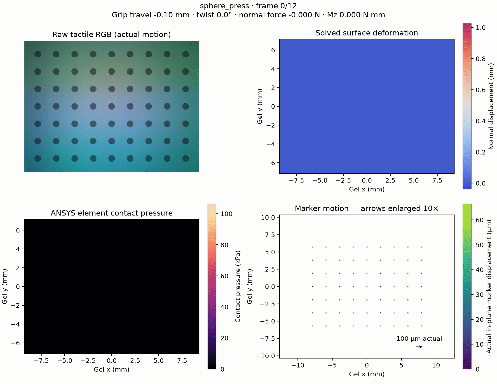
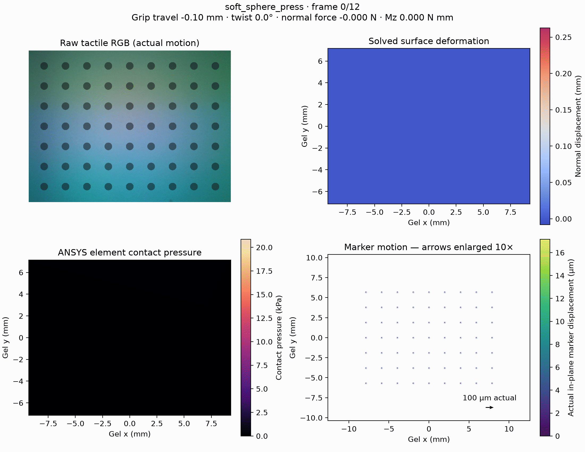

# GelSight ANSYS Simulation

GelSight senses contact through the deformation of a soft gel. The resulting
images and marker motion depend on how the gel and touched object deform, as
well as the friction and adhesion between them. Understanding these effects
helps explain why different materials produce different tactile responses.

This Python simulator uses ANSYS finite-element analysis to study that
connection. Configurable material and contact models describe stiffness,
compressibility, relaxation, friction, and adhesion. The pipeline solves the
mechanical response and renders the deformed gel as synthetic tactile images,
linking material properties to forces, surface deformation, and marker motion.
Shared geometry and loading protocols support comparisons between materials.

<table>
  <tr>
    <th align="center" width="50%">Rigid sphere press<br>Friction μ = 0.5</th>
    <th align="center" width="50%">Soft sphere press<br>E = 50 kPa · Friction μ = 0.5</th>
  </tr>
  <tr>
    <td align="center" width="50%">
      <a href="docs/examples/sphere_press/process.gif">
        
      </a>
    </td>
    <td align="center" width="50%">
      <a href="docs/examples/soft_sphere_press/process.gif">
        
      </a>
    </td>
  </tr>
</table>

Both 3 mm radius spheres follow the same press-and-release trajectory, reaching
1 mm commanded travel against the 100 kPa gel with friction coefficient μ = 0.5.
The soft sphere deforms along with the gel, so the same commanded travel produces
a different contact force, gel deformation, and tactile response. The panels
show tactile color, surface deformation, pressure, and marker motion.
Marker arrows are enlarged 10×; click either animation for the full-size view.

[Rigid-sphere config](configs/sphere_press.json) ·
[Soft-sphere config](configs/soft_sphere_press.json) ·
[Material and contact models](docs/materials-and-contact.md)

The default presets use a uniform Neo-Hookean gel (**E = 100 kPa, ν = 0.49**)
with finite-sliding friction. The coating's mechanical response is represented
within the uniform gel. Geometry, materials, camera, and optics are configurable
around a nominal GelSight Mini model.

ANSYS mechanics uses four CPU cores by default. NVIDIA Warp accelerates
conservative surface projection, camera sampling, and tactile rendering.
Solver GPU acceleration is available as an explicit option.
[Model assumptions](docs/modeling.md) ·
[Materials and contact](docs/materials-and-contact.md) ·
[Sensor calibration](docs/sensor-alignment.md) ·
[Verification](docs/verification.md)

## Features

- **General GelSight contact simulation:** pressing, sliding, and twisting with
  finite-sliding friction. Included generated-object presets use rigid and
  deformable spheres; a configurable rigid flat target is also supported.
- **[Custom object meshes](docs/configuration.md#custom-object-meshes):** import
  rigid STL/OBJ/JSON surfaces or deformable JSON hex volumes, then configure
  material, friction, and motion. Includes rigid and deformable press examples.
- **Material comparison:** finite slabs with rubber, compressible foam,
  effective fabric, and rigid reference surfaces; configurable relaxation,
  directional friction, roughness, and adhesion.
- **[Force-controlled curved objects](docs/configuration.md#cylinders):** rigid
  cylinders pressed to a commanded normal load, held, and slid with the load
  maintained. Diameter, length and axis are config parameters.
- **[Custom gel pads](docs/configuration.md#custom-gel-pads):** a pad that
  narrows towards its sensing face, with its own marker array declared in
  physical units.
- **Tactile rendering and measurements:** CUDA projection and optics, material
  marker tracking, surface deformation, forces and torques, and PNG/GIF previews.
- **[Finite-element views](docs/dataset.md#finite-element-views):** the deformed
  mesh with its element edges, contoured by contact pressure and by total
  displacement, written frame by frame while the run solves.
- **[Live GelSight Mini capture](docs/live-sensor.md):** view and record a
  USB-connected Mini at 320 × 240 RGB, framed so its unloaded markers land on the
  simulator's marker grid, beside a finished run for direct comparison.

## Quick start

Run the commands from the repository root. Python 3.11 or later is required;
the examples below use Python 3.13. ANSYS MAPDL 2025 R2 and a working license
must be installed separately for mechanics. GPU runs also need an NVIDIA GPU
and a compatible driver.

### Linux with pyenv

Install and initialize [pyenv](https://github.com/pyenv/pyenv#installation) and
its [Python build dependencies](https://github.com/pyenv/pyenv/wiki#suggested-build-environment)
first. Then create the project environment:

```bash
pyenv install -s 3.13
pyenv local 3.13
python -m venv .venv
source .venv/bin/activate
python -m pip install --upgrade pip
python -m pip install -e ".[gpu]"
```

For Linux mechanics, add `--exec-file /usr/ansys_inc/v252/ansys/bin/ansys252`
to either run command below, replacing the path with your MAPDL installation.
See [platform requirements](docs/getting-started.md) for platform verification.

### Windows

Create an environment with the pinned Windows dependencies:

```powershell
py -3.13 -m venv .venv
.\.venv\Scripts\python.exe -m pip install -r requirements-lock.txt
```

In the commands below, use `.\.venv\Scripts\python.exe` in place of `python`.
To use Windows MAPDL from WSL, invoke Windows Python. Pyenv inside WSL installs
Linux Python, which requires Linux MAPDL for mechanics.
See [platform setup and troubleshooting](docs/getting-started.md).

### General GelSight contact simulation

Select a contact preset with `--config`. This command uses sphere press as an
example; the same workflow also runs the sliding, twisting, and
deformable-object presets listed below, as well as custom flat-target configs.

```bash
python scripts/run_simulation.py run --config configs/sphere_press.json
```

The config defines the gel, object geometry and material, friction, trajectory,
camera, and optics. Change these settings to describe the contact scenario.
See [configuration and supported options](docs/usage.md).

### Custom object meshes

Use your own object geometry through the same config-driven workflow. Try the
included STL block pressed into the gel:

```bash
python scripts/run_simulation.py run --config configs/imported_rigid_press.json --render-scale 4
```

This example presses the block 0.3 mm and releases. To use another object,
copy the preset and change its mesh file, units, placement, material, and
trajectory.
Rigid objects accept STL, OBJ, or JSON surfaces; deformable objects require a
JSON hex volume with named contact and grip regions.
[Use your own mesh](docs/usage.md#use-your-own-object-mesh) ·
[Mesh formats and placement](docs/configuration.md#custom-object-meshes) ·
[Custom-object examples](docs/examples/README.md#imported-object-examples)

### Material comparison

Use the same command and select a material comparison config:

```bash
python scripts/run_simulation.py run --config configs/material_plane_slide/soft_rubber.json --render-scale 4
```

The config selects `object.geometry`, an `object.material` case with optional
parameter overrides, and independent `surface` and `contact` settings. Reusable
material cases live in `configs/materials/`. The comparison examples reference
`suite.json` for the shared sensor and physical-time loading protocol.
See [configuring geometry and materials](docs/configuration.md).

Fabric and sticky contact require `--libraries PATH_TO_NATIVE_LIBRARIES`; see
[native adapter setup](docs/plane-material-adapters.md). Material parameters are
illustrative and require calibration. Supported geometry/material combinations
are listed in the [configuration guide](docs/configuration.md#supported-combinations).

Check any config without starting ANSYS:

```bash
python scripts/run_simulation.py run --config configs/material_plane_slide/soft_rubber.json --dry-run
```

After installing the package, the equivalent entry point is
`gelsight-ansys run --config PATH` for all examples.

For material comparisons, `--sample-interval-s 0.05` saves fewer frames while
retaining the default mechanical checkpoints. Mechanical time steps and object
mesh resolution can be benchmarked separately.
[Sampling and performance controls](docs/usage.md#mechanical-steps-and-saved-frames)

### Cylinders under a commanded load

Press a rigid cylinder onto the gel at a fixed 4 N, hold it, and slide 2 mm
along its own axis with the load maintained:

```bash
python scripts/run_simulation.py run --config configs/cylinder_press_slide/cylinder_20mm.json --render-scale 4
```

The two shipped diameters, 100 mm and 20 mm, press at the same load rather than
the same travel, so what separates them is curvature alone: the wide cylinder
spreads 4 N over most of the imaged region while the narrow one concentrates it
in a band a few millimetres across. Travel is a result to read, not a setting.
Copy a preset and change `object.geometry` for another diameter, length or axis;
`configs/cylinder_press_slide/suite.json` holds the sensor, protocol and numerics
the cases share.
[Cylinder geometry](docs/configuration.md#cylinders) ·
[Load control](docs/plane-material-adapters.md)

### Mesh and GPU options

General contact presets use a uniform 36 × 30 × 8 gel mesh. Add
`--refine-contact` to the `run` command for the optional local contact refinement.
Plane presets also default to the uniform 36 × 30 × 8 gel and simplified object meshes;
`--object-mesh matched` restores the original plane-object mesh, and
`--object-element-size-m` controls deformable slab resolution independently.
[General mesh options](docs/usage.md#optional-local-contact-refinement) ·
[Plane mesh options](docs/plane-material-adapters.md#numerical-controls-and-resources)

Both workflows default to **four CPU cores for ANSYS mechanics and CUDA for
surface projection and tactile rendering**. General contact runs accept
`--solver-gpu` for solver GPU acceleration and `--allow-unlisted-gpu` for the
ANSYS device override. Plane runs accept `--solver-mode specified` to use the
solver allocation declared in `suite.json`.
[GPU requirements and verification](docs/verification.md#gpu-execution) ·
[Performance guide](docs/performance.md)

## Examples

### General contact presets

Use `python scripts/run_simulation.py run --config PATH` for these examples.

| Preset | Motion | Object / material |
|---|---|---|
| [sphere_press](configs/sphere_press.json) | Indent and release | Rigid sphere |
| [sphere_slide](configs/sphere_slide.json) | Indent, slide, release | Rigid sphere |
| [sphere_twist](configs/sphere_twist.json) | Indent, rotate, release | Rigid sphere |
| [soft_sphere_press](configs/soft_sphere_press.json) | Indent and release | Deformable 50 kPa sphere |
| [rough_sphere_slide](configs/rough_sphere_slide.json) | Indent, slide, release | Deformable 2 MPa sphere; higher friction |

### Custom object presets

These examples import the [included source meshes](assets/meshes/README.md).
Use them as starting points for your own geometry.

| Preset | Motion | Object / material |
|---|---|---|
| [imported_rigid_press](configs/imported_rigid_press.json) | Indent and release | Rigid block imported from STL |
| [imported_soft_press](configs/imported_soft_press.json) | Indent and release | Deformable 50 kPa block imported from a JSON hex mesh |
| [custom_gel_press](configs/custom_gel_press.json) | Indent and release | Rigid sphere on a pad tapering to a 22 × 16 mm face, 11 × 17 array of 0.5 mm markers |

### Material comparison presets

Use `python scripts/run_simulation.py run --config PATH` for these examples.

| Preset | Motion | Object / material |
|---|---|---|
| [plane_rigid_reference](configs/material_plane_slide/rigid_reference.json) | Press, hold, slide, hold | Smooth rigid slab; baseline friction |
| [plane_soft_rubber](configs/material_plane_slide/soft_rubber.json) | Press, hold, slide, hold | 50 kPa Neo-Hookean rubber slab with viscoelastic relaxation |
| [plane_compressible_foam](configs/material_plane_slide/compressible_foam.json) | Press, hold, slide, hold | Compressible Ogden hyperfoam slab with shear and bulk relaxation |
| [plane_fluffy_fabric](configs/material_plane_slide/fluffy_fabric.json) | Press, hold, slide, hold | Effective orthotropic fabric; nonlinear compaction, relaxation, and directional friction |
| [plane_slippery_surface](configs/material_plane_slide/slippery_surface.json) | Press, hold, slide, hold | Smooth rigid slab; lower friction (static 0.12, kinetic 0.08) |
| [plane_rough_surface](configs/material_plane_slide/rough_surface.json) | Press, hold, slide, hold | Rigid slab with resolved sinusoidal surface texture |
| [plane_sticky_surface](configs/material_plane_slide/sticky_surface.json) | Press, hold, slide, hold | Smooth rigid slab; reversible adhesion and cohesive shear |

### Curved object presets

Both presets are pressed to a commanded 4 N, held, slid 2 mm along the cylinder
axis at 5 mm/s under the same load, and held again.

| Preset | Motion | Object / material |
|---|---|---|
| [cylinder_100mm](configs/cylinder_press_slide/cylinder_100mm.json) | Press to 4 N, hold, slide, hold | Rigid smooth cylinder, 100 mm diameter x 50 mm, axis along y |
| [cylinder_20mm](configs/cylinder_press_slide/cylinder_20mm.json) | Press to 4 N, hold, slide, hold | Rigid smooth cylinder, 20 mm diameter x 50 mm, axis along y |
| [custom_gel_cylinder_100mm](configs/custom_gel_cylinder_slide/cylinder_100mm.json) | Press to 4 N, hold, slide, hold | The 100 mm cylinder on the tapered custom pad, sensor turned a quarter so the axis and slide run along x |
| [custom_gel_cylinder_20mm](configs/custom_gel_cylinder_slide/cylinder_20mm.json) | Press to 4 N, hold, slide, hold | The 20 mm cylinder on the same turned tapered pad |

Select a preset with `--config`. The [example guide](docs/examples/README.md)
lists what each one shows and [what it costs to run](docs/examples/README.md#choosing-one),
and describes the trajectories, object materials, and export format.
To work through several, queue them with
[`run_examples.py`](docs/usage.md#run-several-examples); one solver checkout
means starting them at once is no faster. Each run saves
its resolved configuration, measurements, and validation results. The
[detached high-resolution queue](docs/usage.md#detached-high-resolution-example-queue)
exports checked examples into `docs/examples/<config_name>/`.

## Results

Each run creates a unique directory under `outputs/`. Open `report.html` locally
for the frame viewer, or view the PNG and GIF files directly. Outputs include
surface and whole-body NPZ arrays, camera fields, marker motion, CSV metrics,
and GPU evidence. `process.gif` shows the complete four-panel cycle;
`preview.png` provides a representative still. The HTML viewer uses the saved
lossless RGB frames for its slider. Additional panel PNGs and an RGB-only GIF
are [optional](docs/usage.md#visualization-storage); numerical and solver data
are preserved with either setting.

Raw-style RGB is the default: a measured example-sensor background plus the
change in shading predicted from ANSYS surface normals. The supplied optical
table is an appearance reference; it does not establish device-specific calibration.
For a completed general-contact run, render a background-subtracted view
without another mechanics solve:

```bash
python scripts/run_simulation.py render --run outputs/YOUR_COMPLETED_RUN --subtract-background
```

Unchanged pixels are gray (128); brightening and darkening retain their signs.
Exact signed RGB differences are also saved in the NPZ fields. Plane runs save
raw RGB and signed differences during the solve; the replay command above
currently supports general-contact runs only.
[Optical response and subtraction](docs/usage.md#raw-rgb-and-background-subtraction)

Runs that ask for it also write `mesh/frame_*.png` and `mesh.gif`: the deformed
finite-element mesh with its element edges, contoured by contact pressure on the
contact surface and by total nodal displacement on the gel body, with the rigid
object drawn over it as grid lines. Set `visualization.save_mesh_frames` to
enable it and `visualization.mesh_deformation_scale` to exaggerate the shape.
Contour limits grow with the run in 1-2-5 steps and are recorded per frame in
`summary.json`. Any finished run can be drawn afterwards with
`python scripts/render_mesh_views.py --run outputs/YOUR_COMPLETED_RUN`.
[Finite-element views](docs/dataset.md#finite-element-views)

Marker arrows are enlarged 10× with a 100 µm actual-displacement key. Saved
physical data and tactile images retain their actual motion scale.
[Run and replay commands](docs/usage.md) · [Dataset reference](docs/dataset.md)

## Documentation

Start with the [documentation index](docs/README.md).

| Topic | Guide |
|---|---|
| Environment and platforms | [Getting started](docs/getting-started.md) |
| Running and replaying examples | [Usage](docs/usage.md) |
| Selecting geometry, material cases, and parameters | [Configuration](docs/configuration.md) |
| Mechanics and optical assumptions | [Modeling](docs/modeling.md) |
| Uniform gel, coating simplification, object materials, and friction | [Materials and contact](docs/materials-and-contact.md) |
| Plane material models, config composition, and native adapters | [Material comparison](docs/plane-material-adapters.md) |
| Camera, field of view, and markers | [Sensor alignment](docs/sensor-alignment.md) |
| Viewing and recording a physical GelSight Mini | [Live sensor](docs/live-sensor.md) |
| Arrays, units, and visualization | [Dataset](docs/dataset.md) |
| Implementation and solver lifecycle | [Architecture](docs/architecture.md) |
| Numerical checks and recorded results | [Verification](docs/verification.md) |

## Development

`configs/` contains input presets, `src/gelsight_ansys/` implements the pipeline,
`scripts/` provides launchers and checks, and `tests/` contains numerical,
rendering, and privacy contracts. GitHub Actions runs CPU checks on Windows and
Linux; licensed ANSYS checks run separately.

See [Contributing](CONTRIBUTING.md) for checks and export practices. Generated
solver files and private logs stay outside public datasets because they can
contain local machine and license details.

`outputs/` (and `output/`) are ignored by Git. Documentation PNGs and GIFs live
under `docs/rendering/` and `docs/examples/<config_name>/`. Example exports also
retain their full datasets locally, but Git includes only their curated previews
and Markdown. Raw arrays, per-frame images, CSV metrics, HTML viewers, and all
generated JSON under `docs/` are ignored. Source presets under `configs/` remain
in Git. Cloning the repository provides the visual examples; rerun/export a case
to obtain its numerical data and interactive report. Git LFS is not required.
