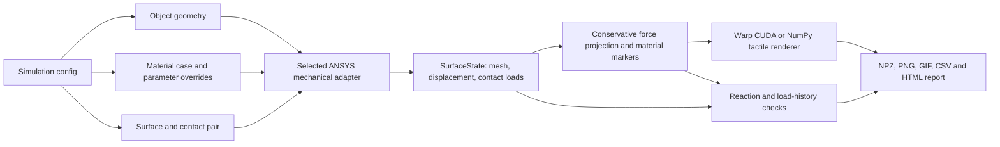

# Pipeline architecture

[Documentation](README.md) · [Modeling](modeling.md) · [Dataset](dataset.md)

The implemented pipeline is an offline sensor simulator with prescribed-motion
contact and a plane adapter that also supports prescribed normal load.
PyMAPDL owns the finite-element solution; solver-independent arrays connect it
to surface processing, markers, rendering, and dataset exports.

| Module | Responsibility |
|---|---|
| `simulation_config.py` | Shared input schema, geometry/material composition, case resolution, capability checks |
| `config.py` | One resolved `Config` for every geometry; common solver, camera, optics, and trajectory settings |
| `saved_config.py` | Imports earlier result snapshots into the current resolved format |
| `plane_config.py` | Slab experiment validation, physical-time sampling, and surface specification; no ANSYS commands |
| `plane_restart.py` | Resume identity checks for saved plane states, solved motion, and required nonlinear restart files |
| `plane_mechanics.py`, `plane_pipeline.py`, `plane_coverage.py` | Slab meshing/fixture, physical-time stepping, retained history, and contact acceptance |
| `ansys/session.py` | MAPDL process ownership, cleanup, reference state, body exports, convergence and GPU evidence |
| `ansys/materials.py`, `ansys/contact.py` | Constitutive tables and friction/adhesion commands from explicit parameters |
| `projection_cuda.py` | Double-precision conservative surface integration and perspective camera sampling on CUDA |
| `mesh.py` | Structured and locally graded gel meshes and deformable sphere meshes |
| `mechanics.py` | Sphere/flat fixtures, multiframe continuation, and result extraction |
| `contracts.py` | Portable `SurfaceState` with native node IDs and result identity |
| `surface.py` | Surface sampling, exact clipped-triangle force integrals and material-marker attachment |
| `camera.py` | Rectified camera rays, perspective-correct material coordinates, sensor marker layout |
| `optics.py`, `optics_cuda.py` | CPU reference and Warp CUDA shading/deforming marker texture |
| `taxim.py`, `taxim_cuda.py` | Example-based angular RGB response, portrait-to-landscape mapping and CUDA evaluation |
| `metrics.py` | Contact wrench, center of pressure and physical consistency checks |
| `artifacts.py` | NPZ/PNG/CSV exports, RGB and complete-panel GIFs, scaled marker vectors and interactive HTML viewer |
| `pipeline.py` | Geometry dispatch, sphere/flat stepping, restart and optical replay |
| `batch/presets.py` | Shared curated preset catalog for validation, queue discovery, and export |
| `run_services.py` | Shared run lifecycle, failure records, camera/background preparation, frame exports, and reports |
| `run_contract.py` | Shared completion and dataset-acceptance rules used by validation, export, and audit |
| `batch/` | Queue, integration validation, export, audit, and RGB comparison workflows; scripts are thin launchers |
| `diagnostics/` | Licensed probes, material/contact coupons, solver monitoring, and benchmarks |
| `native_build.py` | Build the Windows ANSYS material and contact libraries and record their hashes |
| `cli.py` | Explicit `run` and `render` commands |

Each run gets its own directory and MAPDL process. The session closes on success
or exception. Failed runs retain their summary and private traceback. A frame
that fails a physical consistency check is saved for diagnosis; only completed
runs receive `status: passed`. There is no automatic CPU fallback when CUDA or
required solver GPU execution is unavailable.

Re-rendering reads the saved states and never starts ANSYS. It retains original
mechanics evidence while identifying its mechanics source as `saved_ansys_states`.
The copied background and configuration make optical replay independent of the
original calibration-image location.

## Configuration and mechanical adapters

`run_simulation.py run --config PATH` resolves the selected object geometry,
material case and parameter overrides, and contact pair before starting ANSYS.
`pipeline.run` dispatches the resolved configuration to the appropriate internal
mechanical adapter. Material case files contain constitutive behavior only;
geometry and contact remain independent. See [configuration](configuration.md)
for the supported combination matrix and extension points.

Source inputs use schema 3. Every geometry resolves to the same `Config` dataclass.
New saved configurations use schema 4, `config_kind: resolved_contact_simulation`,
and expand referenced material parameters and setup data. `specification` holds
the slab experiment when needed; `plane_options` holds its independent mesh
controls. Solver, optics, camera, and trajectory are direct common fields, without
a runtime proxy or a dummy trajectory. Earlier result snapshots are imported by
`saved_config.py`, so existing datasets and frozen queues remain readable.

`AnsysGel` and `AnsysPlane` are sibling adapters using `AnsysSession`. Each builds
only its own mesh. Their different loading loops share `RunLifecycle` and
`process_frame`: process cleanup, failed-run diagnostics, GPU evidence checks,
report generation, and optical exports follow the same contracts. Slab stepping
retains every converged physical-time substep, including preload history, and
applies the recording's coverage and force checks when recording begins.
Its force fields retain the nominal camera grid while optical images use the
requested render resolution; high-resolution optical geometry remains regenerable
from saved surface states.

Every command's implementation lives in the package, and every file in
`scripts/` is a launcher: a docstring, an import, and `raise SystemExit(main())`.
The dataset workflow is in `batch/` (run, validate, export, audit, queue); the
licensed probes, coupons and benchmarks are in `diagnostics/`; readers for the
solver's own files are modules of their own (`solver_monitor.py`,
`contact_tracking.py`). Each `main` takes its arguments as a list, so a test can
run a command without going through the process, which is what
`tests/test_entry_points.py` does for every launcher. Detached queues copy the
package, launchers, and configs into their own source snapshot, so later
repository edits do not change a running batch.

`run_contract.py` states, once, when a run is a finished dataset: the status it
earns, and every reason it might fall short. The pipeline labels runs with it,
the plane validator admits a pass with it, the exporter refuses incomplete runs
with it, and the auditor re-checks exports with it, so those four commands
cannot drift into different ideas of what passed.

## Custom-mesh extension points

The [mesh configuration interface](configuration.md#custom-object-meshes)
supports rigid imported surfaces and translating deformable hex volumes.

| Location | Responsibility |
|---|---|
| `simulation_config.py`, `config.py` | Resolve file inputs and supported combinations into the common configuration and embedded `ImportedMesh` |
| `mesh_import.py` | Read STL/OBJ/JSON, convert units and transforms, validate connectivity/orientation/Jacobians and boundary sets, and retain source provenance |
| `imported_mechanics.py` | `AnsysImported` overrides the geometry hooks of `AnsysGel` to create imported targets or hex objects with a selected grip |
| `ansys/session.py`, `mechanics.py` | Shared process ownership, gel/contact model, continuation, and result extraction |
| `ansys/materials.py`, `ansys/contact.py` | Constitutive and interface adapters; imported objects currently use the rate-independent elastic/Coulomb path |
| `pipeline.py`, `run_services.py` | Dispatch and shared frame-processing/report contracts, including saved mesh geometry in mechanics provenance |
| `batch/snapshot_meshes.py` | Embed imported geometry into detached snapshot configs before external files can change |
| `batch/` | Validate, discover, export, and audit the registered imported-object presets |

Rigid faces use TARGE170 triangle/quad segments with one pilot point. Deformable
objects use SOLID185 hexes and exterior quad targets; their grip translates.
Face winding follows the outward-normal convention. See the
[ANSYS target-element reference](https://ansyshelp.ansys.com/public/Views/Secured/corp/v252/en/ans_elem/Hlp_E_TARGE170.html)
and [solid-element reference](https://ansyshelp.ansys.com/public/Views/Secured/corp/v252/en/ans_elem/Hlp_E_SOLID185.html).

Extend file readers in `mesh_import.py` while retaining the normalized geometry
contract. Adding tetrahedra or deformable rotation also requires appropriate
mechanical elements, fixtures, extraction, and validation; a reader alone cannot
enable them. New material/contact combinations need capability checks and
numerical verification. The gel surface still uses its existing `SurfaceState`
contract, so CUDA projection, marker attachment, and optical rendering share
the same path as the generated geometries.

Portable checks cover conversion, transforms, invalid geometry, numbering,
fixtures, snapshot isolation, and changed-geometry replay rejection. The
[licensed import checks](verification.md#mesh-import-validation) cover reference
shape agreement, force balance, release, and object/grip displacement.

## Mechanical representation

The gel is a uniform 3D solid. The silicone coating has no separate
mechanical representation. Deformable spheres have their own hex mesh and
translating grip. [Materials and contact](materials-and-contact.md) defines the
assumptions; [the dataset reference](dataset.md) describes whole-body exports.

## Solver lifecycle and contact results

For sphere, flat-target, and imported-object runs, the first frame is an
explicitly identified, analytical unloaded reference with the indenter at its
clearance height. Plane runs save the unloaded reference separately, then solve
preload before recording frame zero. Subsequent frames are converged nonlinear
states. Automatic substeps resolve contact changes. After postprocessing,
`ANTYPE,,REST` restores the previous converged state before advancing the next
load step, preserving frictional history. The code verifies both result time and
increasing load-step number. See [ANSYS multiframe restarts](https://ansyshelp.ansys.com/public/Views/Secured/corp/v252/en/ans_bas/Hlp_G_BAS3_12.html).

Contact pressure is the element-average `CONT,PRES` output. Element status uses
`NMISC,41`: 0 far/open, 1 near/open, 2 sliding, 3 sticking. This is the maximum
over integration points; point statuses are `NMISC,1` through `NMISC,4`. All four point statuses and
elastic-slip distances are also saved. Penetration is
`CONT,PENE`. The general adapter extracts equivalent nodal contact loads with
`FSUM,,CONT`, restricted to contact elements and one surface node at a time.
The plane adapter reads contact element nodal loads from uncompressed result
records and assembles them on the gel surface. Saved-frame checks compare them
against backing and pilot loads, with the inertia and load-control conventions
in the [dataset reference](dataset.md#metrics-and-acceptance).
See [CONTA174 outputs](https://ansyshelp.ansys.com/public/Views/Secured/corp/v252/en/ans_elem/Hlp_E_CONTA174.html)
and [FSUM](https://ansyshelp.ansys.com/public/Views/Secured/corp/v252/en/ans_cmd/Hlp_C_FSUM.html).

For sphere/flat runs, time is a quasi-static loading parameter with no inertia
or rate dependence; imported-object runs use the same time convention. Plane
protocols use physical seconds, retaining Prony and velocity-dependent contact
history. Their `protocol.transient` windows can integrate mass; the shipped
suite enables inertia during sliding. Animation frame duration is for viewing
and does not reproduce measured sensor acquisition timing.

The launcher disables PyMAPDL's default `set_no_abort` override. Every
requested solve sets `NCNV,2` and checks the solution's `CNVG` flag,
requested result time, and load-step identity. Nonconverged continuation is
rejected even if a result file contains the requested time. See the
[ANSYS NCNV command](https://ansyshelp.ansys.com/public/Views/Secured/corp/v252/en/ans_cmd/Hlp_C_NCNV.html).

## Force mapping contract

Native equivalent nodal loads are the source for net force and moment. They are
independent of the image renderer. A linear force-density field is reconstructed
by dividing nodal forces by lumped projected nodal areas. Each triangle is then
clipped to every intersecting pixel, and its linear field is integrated exactly
using the clipped polygon's area and centroid.

The raster integral equals the reconstructed field's integral over the camera
FOV. For a full-pad FOV, it equals the sum of native nodal forces. A cropped FOV
retains off-image force explicitly; the image is never rescaled to the total
sensor load. Raw ANSYS element pressure remains a separate field. The reconstructed
vector density can be signed and spread beyond the raw contact patch; it is
distinct from integration-point pressure.

The raster conserves force. Resultant moments use deformed native surface
locations, nodal forces, and any exported contact couples. A pilot-moment residual is reported separately; moment extraction
under finite rotation and contact discretization needs separate convergence
assessment. [Dataset shapes and signs](dataset.md).

## GPU boundaries

Default ANSYS mechanics uses four CPU cores. Warp performs conservative surface
projection, camera ray sampling, shading and material-marker composition on CUDA.
The projection kernels use double precision and deterministic triangle order;
force integration remains independent of the sampled pressure image. Bounding-box
candidate lists, nodal normals, extraction and reporting still use CPU code.
The CPU projection path skips integrals with exactly zero nodal loads.

`--solver-gpu` enables the alternative three-CPU-plus-GPU ANSYS allocation, with
activation and positive accelerated-flop evidence required. Solver GPU work is
recorded separately from `projection_device` and `render_device`. Mixed u-P may
require partial pivoting and disable sparse GPU work; the formulation comparison
permits that explicitly with `require_gpu=false`.

Per-frame timings distinguish solve commands, result extraction, projection,
rendering, metrics and saves. See [performance](performance.md) for measured
allocations and remaining CPU work.
