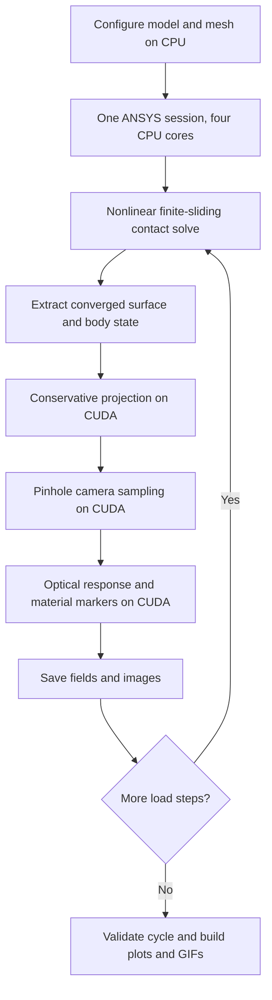

# Performance

[Documentation](README.md) · [High-resolution preview](rendering/README.md)

The generated measurement file `docs/performance-measurements.json` is local-only;
the measurements below remain in Git.

The default uses **four CPU cores for ANSYS mechanics and CUDA for surface
projection, camera sampling, and tactile rendering**. In the matched locally
refined 0.8 mm loading benchmark, total time fell from **421.9 s to 129.9 s**
(7.0 to 2.2 minutes, **3.25× faster**). Forces matched exactly; the largest
surface-displacement difference was 5.1 × 10⁻¹⁸ m.

Uniform meshing remains the default. `--refine-contact` selects the optional
locally refined mesh; `--solver-gpu --allow-unlisted-gpu` selects the optional
three-CPU-plus-one-GPU ANSYS allocation. Both allocations retain CUDA optics.
These results apply to the measured machine and trajectories, not all models.

## Execution path



Load steps retain their deformation and friction history. This pipeline remains
sequential within each trajectory. The [batch queue](../scripts/render_queue.py)
also runs ANSYS examples sequentially, using the observed single solver checkout.
Each successful export is checked before replacing its public example folder.

## Solver benchmarks

The short uniform-mesh benchmark contains seven frames: unloaded, touch, 0.2 mm,
0.4 mm, 0.2 mm, touch, and released. All cases use the same 8,640 gel elements,
material, contact settings, two initial substeps, and convergence guards.

| Equation solver and ANSYS allocation | Solve commands | Total run |
|---|---:|---:|
| SPARSE, 3 CPU + 1 GPU | 264.3 s | 301.4 s |
| MIXED, 3 CPU + 1 GPU | 348.8 s | 385.1 s |
| **SPARSE, 4 CPU** | **79.1 s** | **96.6 s** |

Four-CPU sparse solving was **3.34× faster** than the GPU sparse solve commands.
MIXED was 32% slower than GPU SPARSE and remains an opt-in experimental choice.
All force arrays matched exactly. The largest displacement differences were
3.1 × 10⁻¹⁸ m for CPU SPARSE and 3.3 × 10⁻¹⁸ m for GPU MIXED. Release checks passed:
contact force below 1 µN and gel displacement below 10 nm.

The deeper locally refined benchmark contains six loading frames through 0.8 mm:

| Allocation | Solve commands | Total run |
|---|---:|---:|
| 3 CPU + 1 GPU baseline | 382.6 s | 421.9 s |
| **4 CPU with CUDA projection/rendering** | **112.5 s** | **129.9 s** |

The normal force at 0.8 mm is 0.36087 N in both runs. This deeper comparison is
loading-only; release was tested in the short uniform cycle above.

These are single-run measurements, not a statistical scaling study. CPU solve
times use `perf_counter` around the solve command; the deep-preview GPU baseline
solve time was reconstructed from input/log timestamps. GPU comparison runs used the
older CPU projection, so the total speedup combines mechanics and postprocessing
changes. The solve-command column isolates the measured solver improvement more
closely, including command handling and result selection.

ANSYS recommends strong double-precision performance for sparse GPU solving.
A supported execution path on a consumer GPU does not establish a speedup; the
measured CPU allocation is faster here. [ANSYS GPU requirements](https://ansyshelp.ansys.com/public/Views/Secured/corp/v252/en/installation/win_gpureqt.html).
MIXED is an equation-solution algorithm, separate from material choice or mixed
u-P elements. [ANSYS equation solvers](https://ansyshelp.ansys.com/public/Views/Secured/corp/v252/en/ans_cmd/Hlp_C_EQSLV.html).

## Projection and rendering

Saved-state replay used all six refined states, one warm-up sequence per backend,
and three timed repeats at **320 × 240**. These timings exclude mechanics, state
loading, file output, and plot/GIF construction.

| Stage | CPU baseline | Optimized CPU | CUDA |
|---|---:|---:|---:|
| Conservative surface/force projection | 3.969 s | 0.2783 s | **0.0181 s** |
| Pinhole camera sampling | 0.141 s | 0.1319 s | **0.0150 s** |
| Tactile RGB shading | — | 0.1783 s | **0.00475 s** |

CUDA projection, camera sampling, and shading together take **0.0378 s/frame**,
about **26.4 frames/s** for those stages alone. This is not the throughput of a
new ANSYS simulation. High-resolution queue output uses 1280 × 960 pixels;
these nominal-resolution timing numbers do not describe that larger export.
The GIF's 5 frames/s is playback timing, and trajectory time is a quasi-static
load parameter rather than a prediction of loading-rate effects.

The CPU shortcut skips only force integration for triangles with exactly zero
nodal load. The CUDA implementation uses double-precision conservative triangle
clipping and deterministic triangle ordering, retaining force integrals, element
contact fields, geometry, and material coordinates. Candidate-list preparation
and some geometry work remain on CPU. No pressure smoothing or force
renormalization was introduced.

CPU/CUDA pressure, status, and validity fields matched exactly. Maximum position
error was 5.3 × 10⁻¹⁸ m; per-pixel force error was 3.0 × 10⁻¹⁷ N. CPU/CUDA shading
differed by at most one RGB intensity level. With the same CUDA shader, all six
rendered images matched the reference images exactly at their nominal resolution.

## Resources and licensing

The measured machine has an Intel i7-14700F (20 physical cores, 28 logical
processors), 32 GB RAM, RTX 4070 SUPER with 12 GB VRAM, and NVMe storage. The CPU
has eight performance cores and twelve efficiency cores. [Intel specifications](https://www.intel.com/content/www/us/en/products/sku/236854/intel-core-i7-processor-14700f-33m-cache-up-to-5-40-ghz/specifications.html).

The working ANSYS allowance is four combined CPU/GPU units: either four CPU cores
or three CPU cores plus one solver GPU. GPU projection/rendering in Python uses
no additional ANSYS solver checkout. Concurrent solver licensing is separate.
The tested license permitted one simultaneous solver checkout, so the queue
starts one solver at a time. [ANSYS GPU licensing](https://ansyshelp.ansys.com/public/Views/Secured/corp/v252/en/ans_dan/para_gpu.html).

The sparse log's approximately 276 MB allocation is not total process or peak GPU
memory. An idle GPU utilization snapshot cannot establish utilization during a
solve. Further experiments with CPU placement or distributed solving would need
matched benchmarks before changing defaults.

## Reproduce and monitor

```bash
python scripts/benchmark_projection.py --run PATH_TO_COMPLETE_RUN
python scripts/benchmark_solvers.py --include-cpu-reference --allow-unlisted-gpu
```

Both scripts write structured timing and correctness results; the projection
benchmark does not launch ANSYS. Run summaries include per-frame solve,
extraction, projection, rendering, and saving times plus report-generation time.

The example queue uses `--render-scale 4`, preserves each
preset's mesh, and exports only complete, validated runs. See the local `docs/examples/queue-status.json`
and [detached queue instructions](usage.md#detached-high-resolution-example-queue).
The seven plane-material cases use a separate solver and export path.
Their specimen meshes, 601-frame recordings, and transient slide substeps need
separate resource and runtime measurements; sphere timings do not predict their cost. See
[plane implementation details](plane-material-adapters.md).

## Sampling and object resolution

Material comparisons support independent saved-frame and mechanical checkpoint
intervals. `--sample-interval-s` controls image and dataset output;
`--solve-interval-s` controls mechanical checkpoints, and
`--maximum-time-increment-s` limits the solver's adaptive internal steps.
Every converged recorded substep retains contact-coverage checks. Contact/backing
force balance is required outside inertia windows and recorded inside them;
saved-frame pilot-load and raster checks remain active.
See [sampling controls](usage.md#mechanical-steps-and-saved-frames).

`--object-element-size-m` changes deformable object resolution independently of
the gel mesh. Compare forces, deformation, and contact behavior across resolutions
before selecting a mesh for a study. Fewer elements or saved images alone do not
establish an end-to-end speedup.
