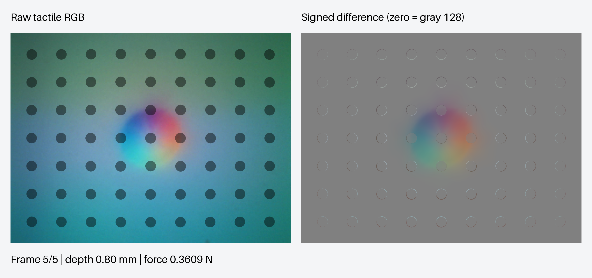

# Rendering and local-mesh preview

[Project overview](../../README.md) · [Model assumptions](../modeling.md)

This preview shows six loading frames with the locally refined gel mesh, from
the unloaded reference to 0.8 mm indentation. Optical replay uses 4× resolution:
each tactile view is 1280 × 960, the comparison is 2704 × 1272, and the four-panel
view is 2200 × 1700.

- [Raw versus subtracted GIF](raw_vs_subtracted_0p8mm.gif) · [peak-frame PNG](raw_vs_subtracted_0p8mm.png)
- [Four-panel loading GIF](loading_preview.gif) · [peak-frame PNG](local_mesh_preview.png)
- [Mesh layout](contact_mesh.png)

Generated `preview_config.json`, `preview_metrics.json`, and
`preview_visualization.json` are retained locally in this folder and ignored by Git.

The GIFs loop the loading sequence with pauses at the first and last frames.
The jump back to the first frame is a replay, not a simulated release. Use the
PNGs to inspect color gradients without the GIF format's 256-color limit.

This saved preview uses the optional `--refine-contact` mesh. New runs use a
uniform mesh by default. See [mesh selection](../usage.md#optional-local-contact-refinement).
The preview's configuration records the original solved mesh and nominal camera.
`preview_visualization.json` records the `--render-scale 4 --backend cuda` optical
override. The physical FOV and material marker attachments are unchanged; higher
resolution does not add mechanical mesh detail. The diagnostic panels retain
the saved force/deformation fields.

The preview mesh uses 0.3 mm surface cells across x = ±3.6 mm and y = ±3.0 mm, with
coarser outer transitions and a 0.178 mm top layer. It retains 8,640 gel elements.
All gel elements use the same Neo-Hookean material (E = 100 kPa, ν = 0.49).
The coating is mechanically homogenized into the gel.

The borrowed optical table has repeated and irregular calibration bins. Its
angular response is smoothed with a Gaussian width of two bins and interpolated
with periodic cubic interpolation. This does not blur the mechanical data or
the markers. Raw RGB retains the measured example-sensor background; the
subtraction view removes the first unloaded image, including its reference
markers, and displays zero change as gray 128. These appearance settings are
not a calibration of a specific physical sensor.

At 0.8 mm, the normal force is 0.36087 N and the global force-balance residual is
0.68%. All solved frames passed the 2% balance check and recorded active ANSYS
GPU acceleration; rendering used CUDA. The four-panel view shows marker arrows
enlarged 10×, with a 100 µm actual-displacement scale. Pressure remains an
unfiltered element field, so its mesh structure is visible.

This loading-only preview does not establish mesh convergence or validate
release, sliding, or twisting. The [full-cycle indenter presets](../examples/README.md#presets)
use uniform gel meshes and have separate validation checks.
